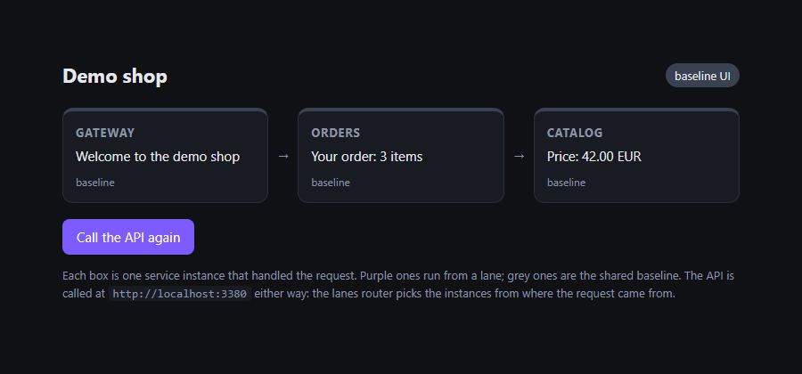
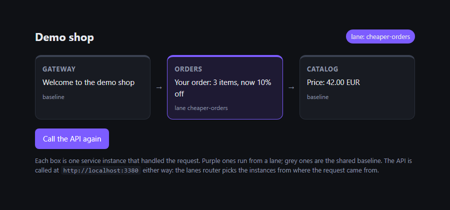
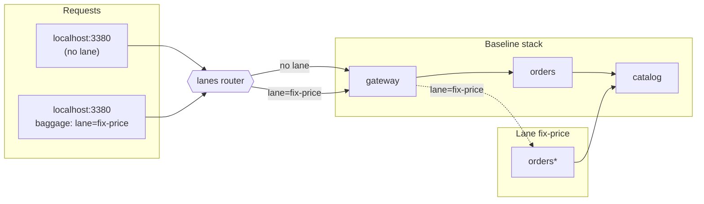
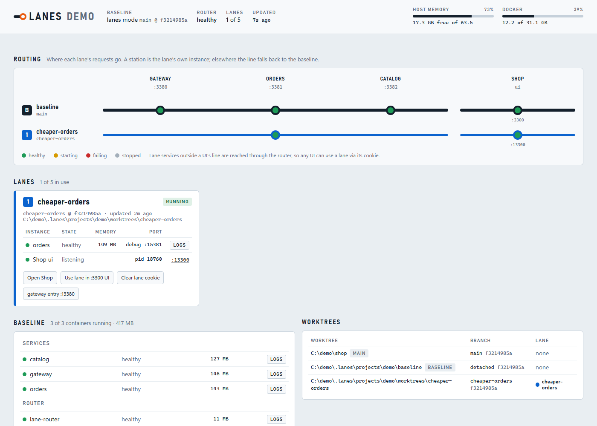

# lanes

**Run many tasks side by side on one Docker Compose stack.** Each task (a bug fix, a feature,
an AI agent's experiment) gets a *lane*: its own copies of only the services it changed. Everything
else is shared with one baseline stack, and requests find the right copies by a header.

<p align="center">
  
  
</p>

Five tasks on a 20-service stack don't need 100 containers. They need the 20 baseline services
plus the two or three each task actually touched.

## Why

- **Parallel work without parallel stacks.** Several developers or agents each test their own
  change against the same databases, queues and services, on one machine.
- **Only changed services are built.** `lanes up` looks at your git diff and starts copies of just
  those services (and your frontend, if you changed it).
- **No code changes.** Java services pass the lane on automatically through the OpenTelemetry
  agent, which lanes attaches for you. Your compose file stays as it is.
- **Made for coding agents.** Agents get a project-specific guide (`lanes guide`), strict rules
  (never touch the baseline or another lane), and a clean hand-over flow.

## How it works



1. **One baseline** runs your normal compose stack from a fixed branch (say `origin/main`).
   A small nginx router takes over the host ports of your services.
2. **A lane** is a git worktree plus containers for the services that differ in it. It gets its
   own ports (base port + 10000 × lane number) for entry points and frontends.
3. **The router** sends a request to a lane's copy when the request carries
   `baggage: lane=<name>`, came in on the lane's own port, comes from the lane's frontend, or carries
   the lane cookie. Otherwise it goes to the baseline.
4. **Services pass the lane on.** Every service-to-service URL goes through the router, and the
   OpenTelemetry Java agent copies the `baggage` header onto outgoing calls, so a request stays in
   its lane across hops even when it passes through baseline services.

More in [docs/how-it-works.md](docs/how-it-works.md).

## Quick start: the demo (about 5 minutes)

You need Docker (Desktop or Engine with Compose v2), git and Node.js 20+.

```sh
git clone https://github.com/TotoBarbota/Lanes.git lanes && cd lanes && npm install && npm link && cd ..
lanes demo lanes-demo       # creates a small three-service shop in ./lanes-demo
cd lanes-demo
lanes doctor
lanes baseline up
lanes baseline ui           # open http://localhost:3300
```

Then change a service in a lane:

```sh
lanes new cheaper-orders    # prints the new worktree's folder; cd there
# edit orders/App.java: change MESSAGE
lanes up --ui               # builds only orders, starts a lane copy of the Shop page
```

Open <http://localhost:13300> (the lane's Shop page) next to <http://localhost:3300>. Only the
lane page shows your change; the rest of the stack is shared. The
[demo README](examples/demo/README.md) walks through the details.

## Use it on your project

```sh
cd your-repo
lanes init                  # drafts lanes.yml from your docker-compose file
lanes doctor
lanes baseline up
lanes agents --write        # optional: teach coding agents to use lanes (AGENTS.md)
```

`lanes init` guesses which services lanes can run, which ones browsers call, which are Java and
where your frontends live. Review the result against [docs/config.md](docs/config.md).
If you'd rather not commit `lanes.yml`, keep it anywhere and run `lanes link <file>`.

Daily flow for a task:

| Step | Command |
|---|---|
| New worktree for the task | `lanes new <branch>` |
| Start or update the lane (after each change) | `lanes up` (add `--ui` for frontends) |
| See what would run | `lanes detect` |
| Logs | `lanes logs <service>` (lane first, then baseline) |
| Everything at a glance | `lanes status` or `lanes dashboard` |
| Done | `lanes down` |

The dashboard also starts, updates and closes lanes: **Start lane** next to a worktree, **Update** and
**Close lane** on a lane's card. Each runs the same command in the background and shows its output
live.



## Coding agents

Run `lanes agents --write` once and commit `AGENTS.md`. Agents then run `lanes guide`, which prints
a guide generated from your `lanes.yml`: how to start their lane, which ports and headers to test
with, where logs are, and hard rules (never start the whole stack, never touch the baseline or
another lane, never commit protected files). When the agent is done it hands over the URLs for you
to test, then closes its lane. See [docs/agents.md](docs/agents.md).

## Requirements and platforms

- Docker with Compose v2, git 2.28+, Node.js 20+.
- Windows is the tested platform today. Linux and macOS are supported by design (no Windows-only
  tools in the core; OS-specific bits live in one module) but not yet tested. Reports welcome.
- Service runtimes: **Java** (automatic header propagation). Other services work if they forward
  the `baggage` header themselves; more runtimes are planned.

## Limitations

- Lanes share the baseline's databases, queues and caches. A lane that writes data writes it for
  everyone. Background jobs in lane copies can be turned off per service (`jobsOff`). Configure
  [`data`](docs/config.md#data) to take snapshots before risky work and restore them afterwards.
- Only HTTP is routed per lane. Kafka consumers and similar in a lane copy compete with the baseline
  for messages unless you turn them off.
- The baseline follows one ref. If your task branch depends on changes the baseline doesn't have,
  include those services in the lane (`lanes detect` tells you which ones differ).

## Similar tools

Header-based routing over a shared baseline is the idea behind
[Signadot](https://www.signadot.com/) sandboxes, [Okteto Divert](https://www.okteto.com/docs/reference/divert/)
and [mirrord](https://mirrord.dev/). Those target Kubernetes. lanes does the same on a single
machine with Docker Compose, and adds worktrees, change detection and agent guidance.

## Docs

- [How it works](docs/how-it-works.md)
- [Configuration reference](docs/config.md)
- [Coding agents](docs/agents.md)
- [Troubleshooting](docs/troubleshooting.md)
- [Contributing](CONTRIBUTING.md) and [security](SECURITY.md)

## License

Not yet chosen. Until a licence is added, all rights are reserved.
