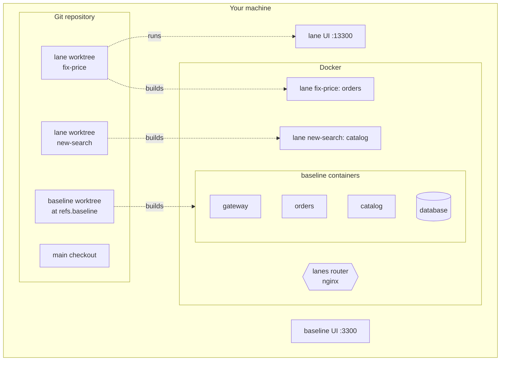
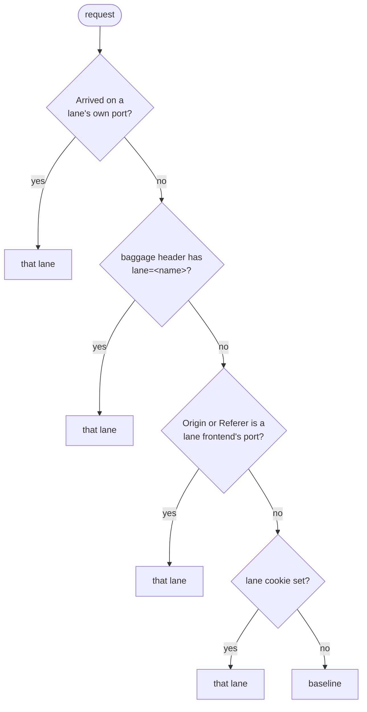

# How lanes works

lanes turns one Docker Compose stack into a shared *baseline* plus any number of small *lanes*.
This page explains the moving parts, so you can predict what lanes will do and debug it when it
doesn't.

## The pieces

| Piece | What it is |
|---|---|
| Baseline worktree | A git worktree of `refs.baseline`, kept under `~/.lanes/projects/<name>/baseline`. The baseline stack is always built from here, never from your working copy. |
| Baseline stack | Your compose stack, started under its usual project name, with one change: routed services lose their host ports, because the router takes them over. |
| Router | An nginx container on the same networks. It owns the host ports of your routed services, and every service-to-service URL is rewritten to go through it. |
| Lane | A git worktree plus containers for the services that changed in it, and optionally frontend dev servers. Registered in `~/.lanes/projects/<name>/state/lanes.json`. |

Nothing is written into your repository. Generated compose files, router config, logs and state
live under `~/.lanes` (or `LANES_HOME`).

## Routing a request

For every request, the router picks a lane in this order:

Then, per service: if the chosen lane runs its own copy of the service, the request goes there;
otherwise it goes to the baseline copy. A lane never needs copies of services it didn't change.

The router always forwards `baggage: lane=<name>` to the service it picked, and sets two response
headers you can check: `X-Lane` (the lane it picked, empty for the baseline) and `X-Lane-Upstream`
(the container that answered). The header names and the baggage key are configurable
(`routing` in [config.md](config.md)).

## Keeping a request in its lane

A request usually crosses several services. For the second hop to reach the right copy, two
things must hold:

1. **Service-to-service calls go through the router.** lanes rewrites every `host:port` in the
   environment of routed services that points at another routed service, so
   `http://orders:3381` becomes `http://lane-router:3381`. For Java services, Spring defaults
   written as `${ORDERS_URL:http://orders:3381}` in `application.yml` are found and rewritten too.
2. **The lane header travels with the call.** For `runtime: java` services lanes attaches the
   [OpenTelemetry Java agent](https://opentelemetry.io/docs/zero-code/java/agent/) with every
   exporter turned off. It only propagates context: an incoming `baggage` header is copied onto
   outgoing HTTP calls. Services in other languages need to forward `baggage` themselves.

## Ports

Lane *N* uses the base port plus `N × lanes.portStride` (default 10000):

| | Baseline | Lane 1 | Lane 2 |
|---|---|---|---|
| Entry service `gateway` (3380) | 3380 | 13380 | 23380 |
| Frontend `web` (3300) | 3300 | 13300 | 23300 |
| Java debugger for `orders` | - | 15381 | 25381 |

Entry ports always route as their lane, which makes them handy for curl and API clients. The
Java debug port is `N × stride + 5000 + (service port mod 1000)`.

## What `lanes up` does

1. Detects changes: files that differ from the fork point with `refs.laneBase` (commits,
   uncommitted edits and untracked files) are mapped to services, frontends and shared folders.
2. Checks memory: refuses to start if host or Docker memory would run too low.
3. Registers the lane and picks a free lane number.
4. Prepares the worktree: runs `worktree.setup`, hides protected files from git, writes local agent
   files.
5. Generates a compose file for the lane's services only. Each copy keeps the service's build,
   environment and volumes, joins the baseline's networks and volumes, and gets a unique container
   name. Background jobs are switched off unless you pass `--jobs`.
6. Builds only services whose inputs changed since their last build, then starts them.
7. Starts frontend dev servers (`--ui`), copying `node_modules` from another checkout with
   identical manifests instead of installing, when possible.
8. Rewrites the router config and reloads nginx if it changed.
9. Waits for health checks and prints URLs, ports and the header to use.

Running `up` again after more changes repeats this; unchanged services keep running untouched.

## Worktrees and protected files

Each lane lives in its own git worktree, so several tasks can be checked out at once without
stashing. Some projects need local, never-committed edits to run (a parent pom swap, a local
properties file). `worktree.setup` makes them, and `worktree.protect` lists files lanes hides
from git (`skip-worktree`, or `assume-unchanged` in sparse checkouts). `lanes hooks install` adds a
pre-commit guard that unstages them if they slip through. Existing hooks (Husky and the like) keep
working: the lanes hooks call them.

## Docker access

lanes talks to the Docker Engine API directly (named pipe on Windows, unix socket elsewhere,
honouring `DOCKER_HOST` and the current Docker context) for status, health and memory, and uses
the `docker compose` CLI for builds and starts. If the API isn't reachable it falls back to the
CLI for everything.
