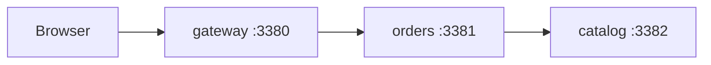

# lanes demo shop

Three Java services and a web page. The browser calls `gateway`, which calls `orders`, which
calls `catalog`. You'll change `orders` in a lane and see only your requests use the changed
copy, while everything else keeps using the shared baseline.



## 1. Start the shared baseline

```sh
lanes baseline up      # builds three small images; the first run pulls a JDK image
lanes baseline ui      # the Shop page on http://localhost:3300
```

Open <http://localhost:3300>. All three boxes are grey: every request runs on the baseline.

## 2. Start a task in its own worktree

```sh
lanes new cheaper-orders
```

This prints the new worktree's folder. Go there and change the message in `orders/App.java`:

```java
static final String MESSAGE = "Your order: 3 items, now 10% off";
```

Then start the lane from that folder:

```sh
lanes up --ui
```

`up` notices that only `orders` changed, builds and starts just that service, and runs a
second copy of the Shop page for this lane.

## 3. See the routing

| Open | What answers |
|---|---|
| <http://localhost:3300> | Baseline everything |
| <http://localhost:13300> | Your lane's `orders`, the baseline `gateway` and `catalog` |

Both pages call the same API address. The lanes router looks at where each request came from
(and the `baggage` header the OpenTelemetry agent passes along) to pick the instances.

From a terminal:

```sh
curl localhost:3380/                                  # baseline
curl -H "baggage: lane=cheaper-orders" localhost:3380/  # your lane
curl localhost:13380/                                 # your lane's own entry port
```

`lanes dashboard` opens a live view of the baseline, the router and every lane.

## 4. Clean up

```sh
lanes down              # from the worktree: stops the lane
lanes baseline down     # from anywhere in the repo
```
